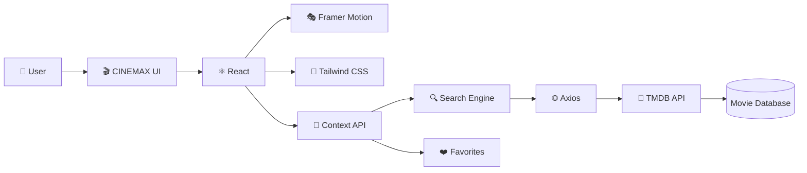

<p align="center">
  
</p>

<p align="center">
  
</p>

<p align="center">
  <b>Discover. Explore. Save. Watch.</b><br>
  A premium movie discovery platform powered by TMDB.
</p>

<p align="center">
  
  
  
  
</p>

---


# 🎥 Overview

CINEMAX is a modern movie discovery experience built with React and TMDB API.

Explore trending titles, search movies instantly, browse by genre, save favorites, and enjoy a polished streaming-platform inspired UI.

---


# ✨ Key Features

| Feature | Status |
|----------|---------|
| 🎬 Trending Hero Carousel | ✅ |
| 🔍 Real-time Search | ✅ |
| 🎭 Genre Filtering | ✅ |
| ❤️ Favorites System | ✅ |
| ⚡ Infinite Scroll | ✅ |
| 🎨 Glassmorphism UI | ✅ |
| 📱 Responsive Design | ✅ |
| 🎞 Framer Motion Animations | ✅ |

### 🎬 Hero Experience

* Auto-rotating trending movie showcase
* Cinematic fullscreen backgrounds
* Smooth slide transitions

### 🔍 Smart Search

* Real-time search
* Debounced API requests
* Search history support
* Instant movie discovery

### 🎭 Movie Discovery

* Genre filtering
* Popular movies
* Trending titles
* Top rated collection
* New releases

### ❤️ Favorites System

* Save favorite movies
* Persistent local storage
* Favorite badge indicator
* Sort & manage saved movies

### ⚡ Performance

* Infinite scrolling
* Lazy image loading
* Skeleton loaders
* Optimized API requests

### 🎨 Premium UI

* Dark streaming platform theme
* Glassmorphism effects
* Smooth Framer Motion animations
* Fully responsive design

---

# 📸 Screenshots

## 🏠 Home Page


---

## 🔍 Browse Movies


---

## ❤️ Favorites


---

# 🛠 Tech Stack

| Category         | Technology      |
| ---------------- | --------------- |
| Frontend         | React 18        |
| Styling          | Tailwind CSS    |
| Routing          | React Router v6 |
| Animations       | Framer Motion   |
| API Client       | Axios           |
| Data Source      | TMDB API        |
| State Management | Context API     |
| Build Tool       | Vite            |

---

# 🏗 Architecture



---

# 🎮 3D Workflow Structure

```md

                 🎬 CINEMAX

      ┌─────────────────────────┐
      │     Home Experience     │
      └───────────┬─────────────┘
                  │
       ┌──────────┴──────────┐
       │                     │
       ▼                     ▼

 🔍 Search Engine      🎭 Movie Discovery

       │                     │

       ▼                     ▼

  🎯 Filters         🎬 Movie Details

       │                     │

       └───────┬─────────────┘
               ▼

        ❤️ Favorites System

               │

               ▼

       💾 Local Storage

---

# 🚀 Getting Started

## Clone Repository

```bash
git clone https://github.com/yourusername/cinemax.git
cd cinemax
```

## Install Dependencies

```bash
npm install
```

## Configure Environment

Create:

```env
VITE_TMDB_API_KEY=YOUR_API_KEY
```

## Start Development Server

```bash
npm run dev
```

---


# 🎨 Design System

### Colors

```css
Background: #0a0a0f
Primary: #e84040
Text: #ffffff
Muted: #a1a1aa
```

---

# ⚡ Performance Optimizations

* Debounced search
* Infinite scroll
* Image lazy loading
* Request caching
* Skeleton loading states
* Component memoization
* 
---

# 🌟 Future Roadmap

* Authentication
* Watchlists
* Movie Reviews
* AI Recommendations
* Streaming Availability
* User Profiles

---

# 🤝 Contributing

Contributions, issues, and feature requests are welcome.

Feel free to fork the project and submit a pull request.

---

# 📜 License

MIT License

---


</p>

<p align="center">
  Built with ❤️ using React, Tailwind CSS and TMDB API
</p>
