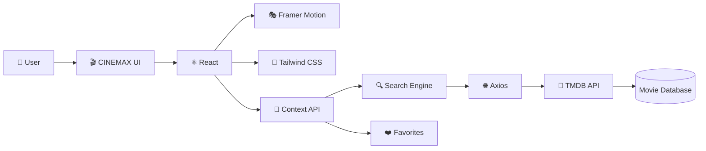

<p align="center">
  
</p>

<p align="center">
  <a href="https://search-movie-at-cinemax.netlify.app/">
    
  </a>
</p>

<p align="center">
  
</p>

<p align="center">
  <b>Discover. Explore. Save. Watch.</b><br>
  A premium movie discovery platform powered by TMDB.
</p>

<p align="center">
  
  
  
  
</p>

---


<p align="center">
  
</p>

CINEMAX is a modern movie discovery experience built with React and TMDB API.

Explore trending titles, search movies instantly, browse by genre, save favorites, and enjoy a polished streaming-platform inspired UI.


---

<p align="center">
  
</p>

| Feature | Status |
|----------|---------|
| 🎬 Trending Hero Carousel | ✅ |
| 🔍 Real-time Search | ✅ |
| 🎭 Genre Filtering | ✅ |
| ❤️ Favorites System | ✅ |
| ⚡ Infinite Scroll | ✅ |
| 🎨 Glassmorphism UI | ✅ |
| 📱 Responsive Design | ✅ |
| 🎞 Framer Motion Animations | ✅ |

---

<p align="center">
  
</p>


## 🏠 Home Page


---

## 🔍 Browse Movies


---

## ❤️ Favorites


---

<p align="center">
  
</p>

<p align="center">


</p>

<table align="center">
<tr>
<td>⚛️ Frontend</td>
<td><b>React 18</b></td>
</tr>

<tr>
<td>🎨 Styling</td>
<td><b>Tailwind CSS</b></td>
</tr>

<tr>
<td>🛣 Routing</td>
<td><b>React Router v6</b></td>
</tr>

<tr>
<td>🎞 Animations</td>
<td><b>Framer Motion</b></td>
</tr>

<tr>
<td>🌐 API Client</td>
<td><b>Axios</b></td>
</tr>

<tr>
<td>🎬 Movie Database</td>
<td><b>TMDB API</b></td>
</tr>

<tr>
<td>🧠 State Management</td>
<td><b>Context API</b></td>
</tr>

<tr>
<td>⚡ Build Tool</td>
<td><b>Vite</b></td>
</tr>
</table>

---
<p align="center">
  
</p>



---
<p align="center">
  
</p>

```md

                 🎬 CINEMAX

      ┌─────────────────────────┐
      │     Home Experience     │
      └───────────┬─────────────┘
                  │
       ┌──────────┴──────────┐
       │                     │
       ▼                     ▼

 🔍 Search Engine      🎭 Movie Discovery

       │                     │

       ▼                     ▼

  🎯 Filters         🎬 Movie Details

       │                     │

       └───────┬─────────────┘
               ▼

        ❤️ Favorites System

               │

               ▼

       💾 Local Storage

---

# 🚀 Getting Started

## Clone Repository

```bash
git clone https://github.com/yourusername/cinemax.git
cd cinemax
```

---


<p align="center">
  
</p>

* Authentication
* Watchlists
* Movie Reviews
* AI Recommendations
* Streaming Availability
* User Profiles

---

# 🤝 Contributing

Contributions, issues, and feature requests are welcome.

Feel free to fork the project and submit a pull request.

---


# 📜 License

MIT License

---


</p>

<p align="center">
  Built with ❤️ using React, Tailwind CSS and TMDB API
</p>
